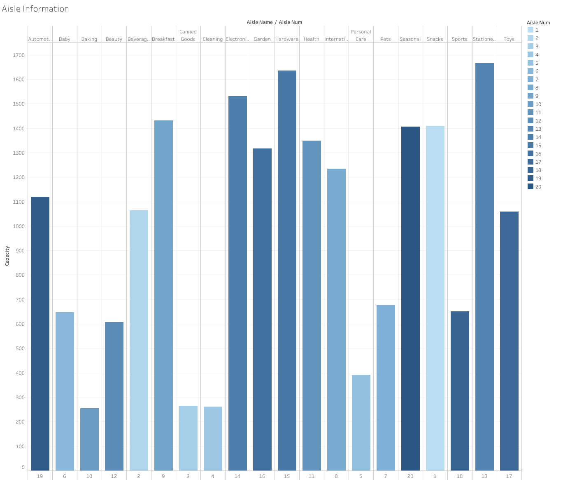
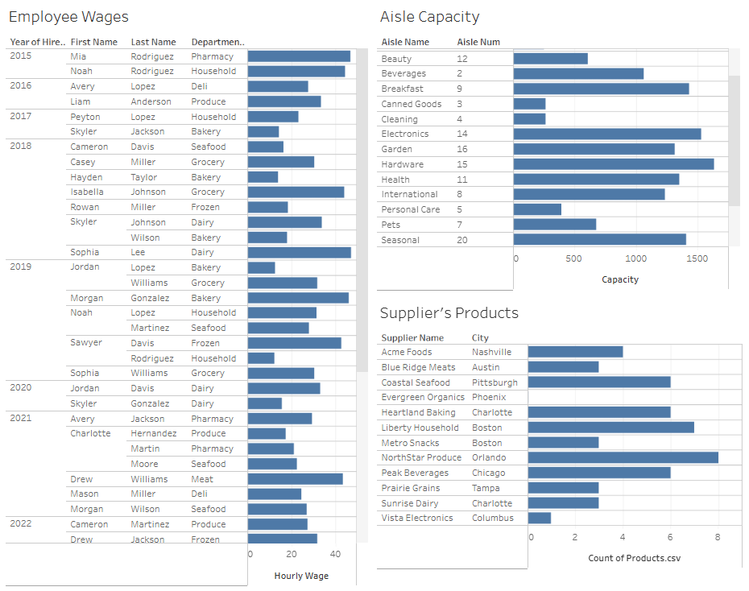

# Retail Store Management Database Project 2

**Team Members:**  
Joanne Lee, Arian Mazloom, Bryson Tanner, Jack Cramer, Richard Kimmig  

---

##  Scenario Description

The data model we created is designed to maintain comprehensive records essential for keeping our retail store operations efficient and organized. It contains all information regarding **suppliers, products, departments, aisles, stores, employees, and work shifts**.

To begin with, the supplier data allows us to track each supplier’s **location and name**, ensuring products arrive on time and in excellent condition. Once the products are received, they are organized by **aisle and department**, giving customers an easy and accessible shopping experience.

Each store is composed of multiple departments, which creates an environment that allows shoppers to find various products without visiting multiple locations. Finally, the model includes detailed employee information such as **hire dates, managers, shifts, and wages**, which helps maintain clean employment records and a clear chain of command.

This database provides the foundation for operational efficiency, workforce management, and data-driven decision-making across our business.

---

##  Data Model
  


**Data Model**

The data model represents the structure and relationships of a grocery store database. It organizes how the store tracks its departments, employees, products, suppliers, and daily operations like shifts and aisles.

At its core, the Store entity connects to multiple Departments, each overseeing a specific category of goods (e.g., Dairy, Produce, Bakery).
Each Department employs multiple Employees, with one serving as the Department Manager. Employees work various Shifts, which are tracked in a many-to-many relationship via the Shift_has_Employees table.

Aisles represent physical areas in the store where products are displayed. Departments are linked to aisles through the Department_has_Aisle table, showing which departments are responsible for which sections.

Suppliers provide products to the store. Each supplier delivers goods that fall under different Product Categories, which are located in specific aisles.
The Products table ties this information together, linking each item to its supplier and product category.

Relationships

- Store → Department: One store has many departments (1:N)
- Department → Employee: One department has many employees (1:N)
- Employee → Shift: Many employees can work many shifts (M:N via Shift_has_Employees)
- Department → Aisle: Many departments can be responsible for many aisles (M:N via Department_has_Aisle)
- Aisle → Product_Category: Each aisle can contain multiple product categories (1:N)
- Product_Category → Product: Each category contains many products (1:N)
- Supplier → Product: Each supplier provides many products (1:N)

**Data Supported**

The database supports storage of:
  - Store locations and departments
  - Employee details, roles, and work schedules
  - Department–aisle assignments
  - Product information (name, category, supplier)
  - Supplier details and sourcing information

**Data Not Supported**

The database does not store:
  - Customer or sales transaction data
  - Real-time inventory counts or restock tracking
  - Product pricing, promotions, or discounts
  - Customer loyalty or membership information
  - Financial or accounting data

---

##  Data Dictionary

| Table Name | Key Fields | Description |
|-------------|-------------|--------------|
| **Store** | `idStore`, `location`, `year_opened` | Contains store-level data. |
| **Aisle** | `aisle_num`, `aisle_name`, `capacity` | Defines aisles and their capacity. |
| **Department** | `departmentid`, `department_name`, `storeid` | Organizes store departments. |
| **Employees** | `employeeid`, `first_name`, `last_name`, `hire_date`, `hourly_wage`, `managerid`, `departmentid`, `storeid` | Stores all employee and management details. |
| **Supplier** | `supplierid`, `supplier_name`, `city` | Tracks supplier information and location. |
| **Products** | `productid`, `Supplier_supplierid`, `Product_Category_product_categoryid` | Links products to suppliers and categories. |
| **Shift** | `shiftid`, `start_time`, `end_time` | Represents working hours for each shift. |
| **Shift_has_Employees** | `Shift_shiftid`, `Employees_employeeid`, `shift_date` | Links employees to specific shifts and dates. |
| **Department_has_Aisle** | `Department_departmentid`, `Aisle_aisle_num`, `Department_Store_idStore` | Connects aisles to departments within stores. |

[View Data Dictionary (PDF)](Data_Dictionary.pdf)
### *Please click the link above to see the full dictionary* 

---

##  SQL Queries

Below are the SQL queries developed for managerial insights.  
Each query includes a **description** and **justification** to explain its business relevance.

---

### 1. Find departments with labor cost per hour exceeding the store average labor cost per hour
```sql
SELECT 
    Department.departmentid,
    Department.department_name,
    Department.storeid,
    SUM(Employees.hourly_wage) AS total_department_wages,
    AVG(Employees.hourly_wage) AS avg_department_wage,
    Store_Averages.store_avg_wage
FROM Department
JOIN Employees 
    ON Department.departmentid = Employees.departmentid
JOIN (
    SELECT 
        storeid, 
        AVG(hourly_wage) AS store_avg_wage
    FROM Employees
    GROUP BY storeid
) AS Store_Averages
    ON Store_Averages.storeid = Department.storeid
GROUP BY 
    Department.departmentid,
    Department.department_name, 
    Department.storeid,
    Store_Averages.store_avg_wage
HAVING 
    AVG(Employees.hourly_wage) > Store_Averages.store_avg_wage;
```
**Description**: 
- Helps store or regional managers identify departments that are paying higher wages than the store average, which can inform labor budgeting decisions and salary restructuring 

### 2. Identify employees who supervise more than 3 employees across multiple departments
```sql
SELECT 
    Employees.employeeid AS manager_id,
    Employees.first_name,
    Employees.last_name,
    COUNT(Subordinates.employeeid) AS num_subordinates,
    COUNT(DISTINCT Subordinates.departmentid) AS num_departments_supervised
FROM Employees
JOIN Employees AS Subordinates 
    ON Employees.employeeid = Subordinates.managerid
GROUP BY 
    Employees.employeeid,
    Employees.first_name,
    Employees.last_name
HAVING 
    COUNT(Subordinates.employeeid) > 3
    AND COUNT(DISTINCT Subordinates.departmentid) > 1;
```
**Description**:
- Helps identify managers with large teams, which could indicate high responsibility, potential burnout, or need for assistant managers.

### 3. Determine departments with the highest product variety based on aisle assignments
```sql
SELECT
    DeptVariety.department_name,
    DeptVariety.storeid,
    DeptVariety.total_product_categories
FROM (
    SELECT 
        Department.department_name,
        Department.storeid,
        COUNT(DISTINCT Product_Category.product_categoryid) AS total_product_categories
    FROM Department
    JOIN Department_has_Aisle 
        ON Department.departmentid = Department_has_Aisle.Department_departmentid
    JOIN Aisle 
        ON Department_has_Aisle.Aisle_aisle_num = Aisle.aisle_num
    JOIN Product_Category 
        ON Product_Category.Aisle_aisle_num = Aisle.aisle_num
    GROUP BY 
        Department.department_name, 
        Department.storeid
) AS DeptVariety
ORDER BY DeptVariety.total_product_categories DESC;
```
**Description**: 
-  Shows which departments offer the greatest variety of product types, helping managers evaluate space allocation, merchandising strategies, and inventory complexity.

### 4. Calculate store productivity: Number of employees per aisle
```sql
SELECT
    Store.idStore AS store_id,
    Employee_Count.total_employees,
    Aisle_Count.total_aisles,
    ROUND(Employee_Count.total_employees / Aisle_Count.total_aisles, 2) AS employees_per_aisle
FROM Store
JOIN (
    SELECT 
        Department.storeid,
        COUNT(DISTINCT Employees.employeeid) AS total_employees
    FROM Department
    JOIN Employees 
        ON Department.departmentid = Employees.departmentid
    GROUP BY Department.storeid
) AS Employee_Count
    ON Employee_Count.storeid = Store.idStore
JOIN (
    SELECT 
        Department.storeid,
        COUNT(DISTINCT Department_has_Aisle.Aisle_aisle_num) AS total_aisles
    FROM Department
    JOIN Department_has_Aisle 
        ON Department.departmentid = Department_has_Aisle.Department_departmentid
    GROUP BY Department.storeid
) AS Aisle_Count
    ON Aisle_Count.storeid = Store.idStore;
```
**Description**: 
- Measures staffing efficiency. Stores with high employees-per-aisle may be overstaffed; low ratios may indicate understaffing and customer service risk.

### 5. Find suppliers whose products are placed in the highest number of aisles across all stores
```sql
SELECT 
    Supplier.supplier_name,
    COUNT(DISTINCT Aisle.aisle_num) AS total_aisles_stocked
FROM Supplier
JOIN Products 
    ON Supplier.supplierid = Products.Supplier_supplierid
JOIN Product_Category 
    ON Products.Product_Category_product_categoryid = Product_Category.product_categoryid
JOIN Aisle 
    ON Product_Category.Aisle_aisle_num = Aisle.aisle_num
GROUP BY 
    Supplier.supplier_name
HAVING 
    COUNT(DISTINCT Aisle.aisle_num) = (
        SELECT MAX(aisle_count)
        FROM (
            SELECT 
                Supplier.supplierid,
                COUNT(DISTINCT Aisle.aisle_num) AS aisle_count
            FROM Supplier
            JOIN Products 
                ON Supplier.supplierid = Products.Supplier_supplierid
            JOIN Product_Category 
                ON Products.Product_Category_product_categoryid = Product_Category.product_categoryid
            JOIN Aisle 
                ON Product_Category.Aisle_aisle_num = Aisle.aisle_num
            GROUP BY Supplier.supplierid
        ) AS Supplier_Aisle_Counts
    );
```
**Description**: 
-  Shows which suppliers have the widest in-store presence. Useful for negotiating contracts, prioritizing strong partners, or identifying overdependence on one supplier.

---

##  Visualizations

Supplier Locations


[](https://us-east-1.online.tableau.com/#/site/jnl63774-f8235c8c77/views/Group5Project2/Dashboard1?:iid=4)

Please click on the image to get redirected to the Tableau page

---

##  Summary

This project demonstrates the design, implementation, and analysis of a relational database system built to support the core operations of a retail grocery store. Through a carefully constructed data model, we captured key operational elements including suppliers, products, employees, departments, aisles, and store locations. This structure allows the organization to track the flow of goods from suppliers to store aisles, manage employee schedules and reporting hierarchies, and maintain organized department-aisle assignments across multiple store locations.

Using this database, we developed a series of complex SQL queries that provide actionable managerial insights. These queries leverage subqueries, HAVING clauses, and aggregate functions to answer real business questions—such as identifying high-cost departments, understanding managerial workload, evaluating product variety, assessing store productivity, and analyzing supplier distribution across aisles. Together, these insights support more informed decision-making in staffing, merchandising, budgeting, and supplier relations.

The accompanying visualizations and Tableau dashboard further demonstrate how this data can be transformed into meaningful analytics. From supplier distribution maps to aisle capacity breakdowns, the visual tools help communicate trends and findings in a clear and accessible way.

Overall, this project highlights how a well-designed database, combined with thoughtful analysis, can improve operational efficiency, enhance workforce management, and support strategic planning within a retail environment. It also showcases the power of SQL and data modeling in building scalable systems that address real-world business needs.

---


